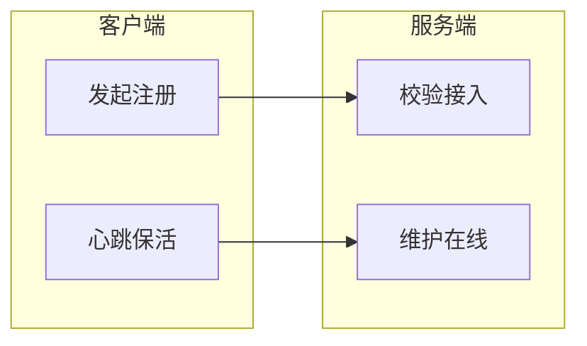
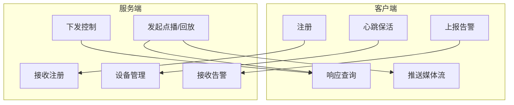

# 国标服务器系统需求规格说明书

## 1. 引言

### 1.1 目的

本文档描述国标服务器系统的功能需求，从使用场景和业务功能角度定义系统应具备的能力。文档不涉及技术选型与实现细节，供产品规划、需求评审及后续设计参考。

### 1.2 范围

- **系统名称**：国标服务器系统
- **标准依据**：GB/T 28181-2022《公共安全视频监控联网系统信息传输、交换、控制技术要求》
- **系统组成**：服务端（平台）+ 客户端（设备）两部分
- **适用对象**：公共安全、企业机构、智能交通、跨区域联网等视频监控场景

### 1.3 术语与缩略语

| 术语 | 说明 |
|------|------|
| 国标 | GB/T 28181 系列标准，公共安全视频监控联网系统相关技术要求 |
| 平台 | 作为服务端运行的视频监控管理平台，负责资源汇聚、调度与管理 |
| 设备 | 作为客户端运行的摄像头、NVR、下级平台等，向平台注册并推送资源 |
| SIP | Session Initiation Protocol，会话初始协议，用于信令控制 |
| PTZ | Pan-Tilt-Zoom，云台控制（转动、变焦等） |
| 级联 | 平台之间上下级互联，下级平台接入上级平台 |

---

## 2. 使用场景

### 2.1 公共安全领域

| 场景 | 典型用户 | 核心诉求 | 典型流程 |
|------|----------|----------|----------|
| 社会治安监控 | 公安部门 | 街道、广场、公园等公共场所实时监控，案件发生时调阅录像、追踪嫌疑人 | 接入辖区摄像头 → 实时监控 → 案发后检索录像 → 追踪嫌疑人 |
| 交通管理 | 交管部门 | 实时监控路况、流量，事故快速响应，信号灯优化 | 接入交通摄像头 → 监控流量 → 事故时快速调阅 → 协调处置 |
| 应急指挥 | 消防/救援/医疗 | 灾害发生时跨部门共享视频，制定救援方案 | 汇聚多部门视频 → 统一指挥视图 → 制定救援方案 |

### 2.2 企业与机构安全

| 场景 | 典型用户 | 核心诉求 | 典型流程 |
|------|----------|----------|----------|
| 工厂园区监控 | 企业安保 | 生产区、仓库、办公区监控，危险区域异常监测 | 接入厂区摄像头 → 实时监控 → 异常告警 → 处置记录 |
| 金融机构安保 | 银行/证券 | 营业厅、金库、自助银行监控，可疑行为预警 | 接入各区域摄像头 → 24 小时监控 → 告警联动 |
| 学校医院安全 | 学校/医院 | 教学楼、操场、病房、药房等区域安全监控 | 接入校园/院区摄像头 → 重点区域监控 → 事件追溯 |

### 2.3 智能交通

| 场景 | 典型用户 | 核心诉求 | 典型流程 |
|------|----------|----------|----------|
| 智能公交 | 公交调度中心 | 车内监控、乘客行为、行驶路线与速度监控 | 接入车载摄像头 → 实时监控车内情况 → 异常事件处置 |
| 电子警察 | 交管部门 | 违法抓拍、证据传输、违法处理 | 接入电子警察设备 → 违法抓拍 → 证据上传 → 违法处理 |

### 2.4 跨区域联网

| 场景 | 典型用户 | 核心诉求 | 典型流程 |
|------|----------|----------|----------|
| 城市间联网 | 多城市公安 | 跨区域视频共享、协同追捕 | 多城市平台级联 → 资源共享 → 协同追踪 |
| 省际联网 | 省级公安 | 全省视频资源整合、重大活动/灾害统一指挥 | 省-市-区级联 → 资源汇聚 → 统一指挥调度 |

---

## 3. 系统配置

系统需提供统一的配置能力，供服务端和客户端共同使用。

### 3.1 本地国标信息

配置本机国标身份信息，包括但不限于：

- 平台/设备 ID
- SIP 域
- 信令地址与端口
- 其他国标协议要求的身份与网络参数

### 3.2 流媒体配置

配置媒体传输相关参数，包括但不限于：

- 媒体端口范围
- 传输协议（如 TCP/UDP）
- 编码格式支持
- 流媒体服务器地址（如适用）

---

## 4. 服务端（平台）功能需求

### 4.1 设备接入与管理

- **手动添加**：支持手动添加下级平台或设备，无需等待其主动注册
- **黑名单/白名单**：支持黑名单（禁止接入）和白名单（允许接入）机制
- **白名单免鉴权**：白名单内的设备/平台可不携带鉴权信息即认证成功
- **独立配置**：每个下级平台或设备可配置独立的鉴权密码和流媒体地址；非强制，有优先级：未配置时使用系统默认配置，已配置时使用其自身配置
- **设备注册**：接收下级设备/平台的注册请求，完成身份校验与接入
- **设备注销**：处理设备主动注销或异常离线
- **设备目录**：维护设备树（摄像头、NVR、下级平台等），支持目录查询
- **设备状态**：查询设备在线状态、录像状态、存储状态等
- **心跳保活**：接收设备心跳，判断在线/离线

### 4.2 实时视频

- **实时点播**：向指定设备发起实时视频请求，接收并展示视频流
- **多路并发**：支持多路视频同时点播
- **视频分发**：将接入的视频流分发给多个观看端（如大屏、客户端）

### 4.3 录像与回放

- **录像存储**：对实时视频进行录像存储
- **历史检索**：按时间、设备、事件等条件检索录像
- **历史回放**：向设备发起回放请求，接收并播放历史录像
- **录像下载**：支持将历史录像下载到本地

### 4.4 设备控制

- **云台控制（PTZ）**：上下左右转动、变焦、光圈等
- **看守位**：查询/设置看守位，支持看守位巡航
- **巡航轨迹**：查询巡航轨迹列表及详情
- **布撤防**：设备布防/撤防控制
- **辅助开关**：辅助输出控制（如补光灯、雨刷等）

### 4.5 告警与事件

- **告警接收**：接收设备上报的报警事件（入侵、遮挡、移动侦测等）
- **告警处理**：告警确认、处置、记录
- **事件订阅**：订阅 PTZ 位置变化等事件，接收通知

### 4.6 语音对讲与广播

- **语音对讲**：与设备进行双向语音对讲
- **语音广播**：向设备下发语音广播

### 4.7 平台级联

- **上级接入**：作为下级平台接入上级平台
- **下级管理**：作为上级平台管理下级平台/设备
- **资源汇聚**：汇聚下级资源，向上级提供统一视图

### 4.8 运维与扩展（GB28181-2022 新增）

- **图像抓拍**：向设备发起图像抓拍请求
- **软件升级**：向设备下发软件升级指令
- **存储卡状态**：查询设备存储卡状态

---

## 5. 客户端（设备）功能需求

### 5.0 本机目录编组管理（独立功能）

- **编组管理**：对本机设备/通道进行编组，支持自定义目录层级结构和 ID 编码规则
- **统一结构**：多上级平台配置时复用同一套编组结构，无需重复维护
- **按需推送**：各上级平台可单独配置要推送的组或摄像头，实现差异化推送

### 5.1 平台接入

- **多平台配置**：支持配置多个上级平台，可同时向多个平台注册并保持连接
- **注册**：向各平台发起注册，携带设备标识、地址等信息
- **保活**：定期向各平台发送心跳，维持在线状态
- **注销**：主动或异常时向平台注销

### 5.2 信息上报

- **目录推送**：向上级平台主动推送设备目录，基于 5.0 编组结构，按各平台配置推送选定组或摄像头
- **设备目录**：响应平台的目录查询，上报设备/通道信息
- **设备状态**：响应状态查询，上报在线、录像、存储等状态
- **看守位/巡航**：响应看守位、巡航轨迹等查询（若设备支持）

### 5.3 媒体流推送

- **实时视频**：响应点播请求，推送实时音视频流
- **历史回放**：响应回放请求，推送历史录像流
- **录像下载**：响应下载请求，推送录像文件流

### 5.4 远程控制响应

- **云台控制**：接收并执行 PTZ 控制指令
- **布撤防**：接收并执行布防/撤防指令
- **辅助开关**：接收并执行辅助输出控制

### 5.5 告警与事件

- **告警上报**：检测到报警时主动向平台上报
- **事件通知**：响应事件订阅，上报 PTZ 位置变化等事件

### 5.6 语音交互

- **语音对讲**：响应对讲请求，支持双向语音
- **语音广播**：接收并播放平台下发的语音广播

### 5.7 扩展能力（GB28181-2022）

- **图像抓拍**：响应抓拍请求，返回抓拍图像
- **软件升级**：接收并执行升级指令
- **位置信息**：支持移动设备位置（MobilePosition）订阅与上报

---

## 6. 业务流程

### 6.1 注册与保活

- 客户端向平台发起注册，携带设备标识、地址等信息
- 平台根据黑名单/白名单及鉴权规则完成校验
- 注册成功后，客户端定期发送心跳，平台维护设备在线状态

### 6.2 实时点播

- 平台向指定设备发起实时点播请求
- 设备响应请求，建立媒体通道并推送视频流
- 平台接收并展示/分发视频流

### 6.3 历史回放

- 平台向设备发起历史回放请求，指定时间范围
- 设备响应请求，推送对应时段录像流
- 平台接收并播放

### 6.4 设备控制

- 平台下发云台、布撤防、辅助开关等控制指令
- 设备接收并执行，必要时上报执行结果或状态变化

### 6.5 告警处理

- 设备检测到告警时主动向平台上报
- 平台接收告警，支持确认、处置、记录

### 6.6 整体交互示意

---

## 7. 非功能需求（可选）

以下为非功能需求的业务级描述，具体指标可在后续设计中细化。

### 7.1 并发规模

- 服务端应支持一定规模的设备/平台并发接入
- 支持多路视频同时点播与分发
- 具体数量根据部署场景确定

### 7.2 可用性

- 系统应具备一定的容错与恢复能力
- 关键功能在异常情况下应有降级或提示机制

### 7.3 安全

- 支持鉴权与访问控制
- 支持黑名单/白名单等接入管控
- 敏感配置与数据应有保护措施

### 7.4 可维护性

- 配置应便于管理与变更
- 关键操作应有日志记录，便于问题追溯

---

## 附录：后续可补充内容

- 各场景下的**用户角色**与**权限**需求
- **多级平台**（省-市-区）的级联业务规则
- **与其他系统**（如违法处理、指挥调度）的对接需求
- **数据保留**、**审计日志**等合规需求
