# 国标服务器系统架构设计

## 1. 引言

### 1.1 目的

本文档描述国标服务器系统的技术架构，为 MVP 及后续迭代开发提供技术蓝图。基于《国标服务器系统需求规格说明书》和《功能清单》编制。检核报告见 [docs/架构设计检核.md](docs/架构设计检核.md)。

### 1.2 范围

- **系统**：国标服务器系统（服务端 + 客户端双模式）
- **标准**：GB/T 28181-2022
- **聚焦**：MVP 功能对应的架构，兼顾一期扩展

### 1.3 术语

| 术语 | 说明 |
|------|------|
| SIP | 会话初始协议，GB28181 信令通道 |
| RTP | 实时传输协议，媒体流传输 |
| SDP | 会话描述协议，媒体协商 |
| PTZ | 云台控制 |

---

## 2. 系统总体架构

### 2.1 双模式整体视图

系统同时具备**服务端（平台）**和**客户端（设备）**两种运行模式，可独立或同时启用。两种模式之下，共同依赖一层 C++ 基础设施，用于提供统一的网络 IO、线程池、定时器、日志与配置等能力：

- **服务端模式**：接收下级设备/平台注册，管理设备树，发起点播/回放/控制，接收媒体流与告警
- **客户端模式**：向多个上级平台注册，推送目录与媒体流，响应控制与查询
- **基础设施层**：基于 ZLToolKit 提供 TCP/UDP 服务器、HTTP API/WebSocket 服务、线程池、定时器、日志与配置等通用能力，上层的 SIP 信令、流媒体协调以及管理 API 均在此之上构建。

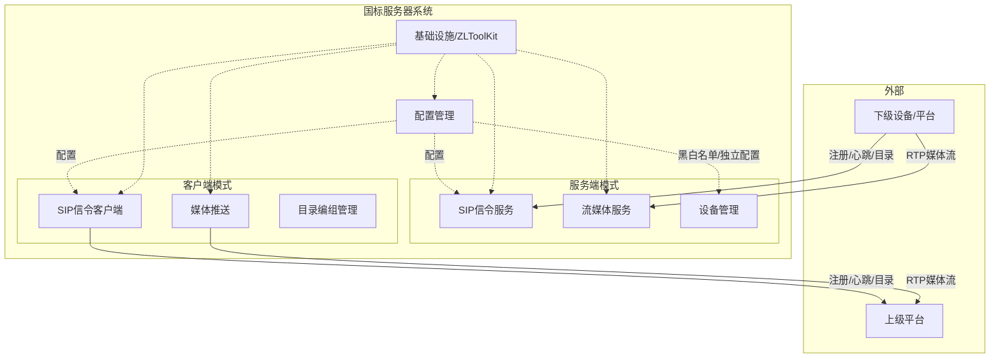

### 2.2 信令与媒体分离

GB28181 采用信令与媒体分离架构：

| 通道 | 协议 | 职责 |
|------|------|------|
| 信令通道 | SIP | 注册、心跳、目录、点播/回放请求、控制指令、告警上报 |
| 媒体通道 | RTP/RTCP | 音视频流传输 |

SDP 在 SIP 消息中携带，用于协商媒体地址、端口、编码格式等。

### 2.3 与 GB28181 协议栈对应

```
应用层：设备管理、目录编组、告警处理、录像存储
    ↓
信令层：SIP（Register、Invite、Message、Notify 等）
    ↓
传输层：UDP/TCP
    ↓
网络层：IP
```

---

## 3. 模块划分

### 3.1 模块总览

| 模块 | 职责 | 对应功能 | 模式 |
|------|------|----------|------|
| 配置管理 | 本地国标信息、流媒体配置、黑白名单、下级独立配置 | CFG-001, CFG-002, SVR-102~105 | 共用 |
| 用户与鉴权 | 用户登录、默认 admin 可修改密码、会话校验 | 见 4.1 用户登录 | 共用 |
| 基础设施 / ZLToolKit | 网络 IO、HTTP/WebSocket 服务、线程池、定时器、日志、配置等通用基础能力 | - | 共用 |
| SIP 信令 | 注册/注销、心跳、目录、点播/回放信令、控制信令 | SVR-106~110, SVR-201, SVR-303, SVR-401, CLT-101~104 | 服务端+客户端 |
| 设备管理 | 设备树、在线状态、手动添加、目录维护 | SVR-101, SVR-108~110 | 服务端 |
| 流媒体服务 | 接收/分发 RTP 流、录像存储、回放 | SVR-201~203, SVR-301~303 | 服务端 |
| 媒体推送 | 响应点播/回放，推送 RTP 流 | CLT-301~302 | 客户端 |
| 目录编组 | 本机编组、按平台配置推送 | CLT-001~003, CLT-201 | 客户端 |
| 告警处理 | 告警接收、处置、记录 | SVR-501~502, CLT-501 | 服务端+客户端 |

### 3.2 模块依赖关系

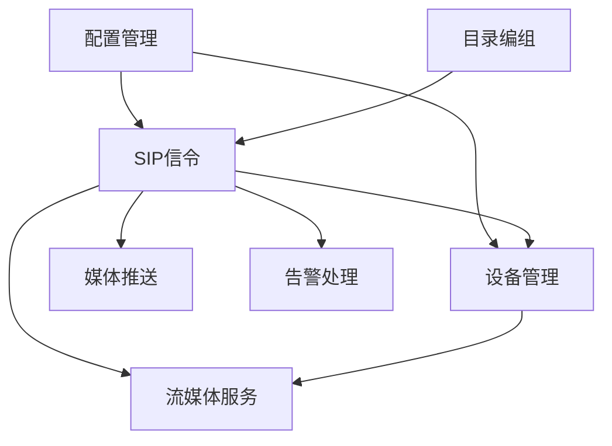

### 3.3 各模块职责说明

**配置管理**
- 存储与提供：平台/设备 ID、SIP 域、信令地址端口、流媒体端口范围、传输协议、编码格式
- 黑白名单：设备/平台 ID 列表及策略
- 下级独立配置：每个下级的鉴权密码、流媒体地址（可选，未配置时用系统默认）

**SIP 信令**
- 服务端：监听 SIP 端口，处理 Register、Invite、Message、Notify 等，调用设备管理完成鉴权与状态更新
- 客户端：向各上级平台发起 Register、心跳，响应 Catalog 查询，处理 Invite（点播/回放）、Message（控制）

**设备管理**
- 设备树：层级结构（平台、设备、通道）
- 在线状态：基于心跳判断
- 手动添加：预置设备/平台信息，无需等待注册
- 目录维护：接收 Catalog 更新设备树

**流媒体服务**（本系统内为对 ZLM 的协调层）
- 收流协调：点播/回放前调用 ZLM openRtpServer，将返回的端口填入 SDP，由 ZLM 实际接收 RTP
- 录像存储：调用 ZLM startRecord；录像元数据（设备、时间、流 ID）存本系统库，检索时查库并拼 ZLM 播放 URL
- 回放：本系统查录像元数据，向设备发起回放 INVITE 或直接使用 ZLM 录像 URL
- 分发（一期）：ZLM 将单路流分发给多观看端
- **无人观看断流**：利用 ZLM `on_stream_none_reader` Hook，无人观看时关闭收流/转发并向下级或上级发 BYE，节省实时流带宽（见 9.5）

**媒体推送**（客户端模式）
- 上级请求的流此时未必已在 ZLM 中，**由 SIP 信令控制下级向本系统推流，再转发给上级**
- 收到上级 INVITE 后：解析上级 SDP → 向本系统下级发 INVITE（点播/回放）→ 下级向 ZLM 推流 → ZLM 收流后由本系统调用 startSendRtp 向上级推送
- 实时/回放均按上述「下级推流到 ZLM → ZLM 转发上级」链路

**目录编组**
- 编组结构：设备/通道的层级与 ID 编码
- 按平台配置：各上级平台可配置要推送的组或摄像头
- 目录生成：基于编组与配置生成 Catalog 内容

**告警处理**
- 服务端：接收 Notify 告警，确认、处置、记录
- 客户端：检测告警，构造 Notify 上报

**用户与鉴权**
- 用户登录：默认用户 **admin**，默认密码 **admin**，首次使用后建议修改
- 密码修改：支持在界面修改当前用户密码，存 PostgreSQL
- 会话：登录成功后发放 token 或 session，前端请求 API 时携带，未登录访问需跳转登录页

**基础设施 / ZLToolKit**
- 网络 IO：基于 ZLToolKit 提供的 TCP/UDP 封装与事件循环，实现 HTTP API、WebSocket 及后续扩展的网络服务，避免直接操作底层 socket/epoll。
- 线程与任务：使用线程池、定时器等能力调度后台任务（周期性心跳检测、清理超时会话、定时拉流/停流等），为 SIP、流媒体服务、告警处理等提供统一的并发基础。
- 日志与配置：统一使用 ZLToolKit 的日志系统输出关键操作日志（注册、点播、控制、告警、ZLM 调用等），并可结合 INI 配置读取通用配置项，与 PostgreSQL 中的业务配置共同组成配置中心。
- 公共工具：复用 ZLToolKit 中的缓冲区、线程同步、事件广播等通用工具，减少自研基础设施代码量，提高稳定性与可维护性。

---

## 4. 前端页面与交互

### 4.1 页面上可见功能

前端（Vue + Element Plus）经 Nginx 反向代理访问（对外 80/443，转发至本系统 8080），提供以下页面与功能：

| 功能模块 | 页面/入口 | 可见操作 | 对应后端 |
|----------|------------|----------|----------|
| **用户登录** | 登录页 | 用户名/密码登录；默认 **admin** / **admin**，支持修改密码 | 用户与鉴权 |
| **系统配置** | 配置页 | 本地国标信息（ID、SIP 域、信令端口）、流媒体配置、ZLM 地址 | 配置管理 |
| **服务端-设备管理** | 设备树页 | 设备树展示、在线/离线状态、手动添加、黑白名单、下级独立配置 | 设备管理、配置管理 |
| **服务端-实时视频** | 监控页 | 选择设备、预览、多路分屏、播放控制 | SIP 信令、ZLM |
| **服务端-录像回放** | 录像页 | 按设备/时间检索、回放、下载 | 流媒体服务、ZLM |
| **服务端-设备控制** | 监控页/PTZ 面板 | 云台方向、变焦、看守位、巡航 | SIP 信令 |
| **服务端-告警** | 告警页 | 告警列表、确认、处置、记录 | 告警处理 |
| **客户端-目录编组** | 编组页 | 编组管理、按平台配置推送范围 | 目录编组 |
| **客户端-平台接入** | 平台页 | 多平台配置、连接状态、注册/注销 | SIP 信令 |
| **模式切换** | 导航/布局 | 服务端模式 / 客户端模式切换 | - |

### 4.2 前端与后端交互

- **REST API**：登录/登出、修改密码、配置 CRUD、设备列表、点播/回放请求、告警列表、PTZ 控制等；需登录后携带 token/session 访问
- **WebSocket**：实时推送（设备状态、告警、流状态变化），建立时校验登录态
- **视频流**：通过 ZLM 的 RTSP/HTTP-FLV/HLS 等 URL 播放，前端播放器采用 **jessibuca**
- **UI 组件**：所有管理界面基于 Element Plus 提供的表单、表格、布局、对话框、菜单等组件构建，统一界面风格与交互体验。

### 4.3 架构覆盖情况

| 模块 | 架构是否考虑 | 说明 |
|------|--------------|------|
| 前端端口 | 是 | 7.2 端口规划含 8080 |
| 前端职责 | 是 | 8.2 明确 Vue 负责管理界面 |
| 页面结构 | 新增 | 本节 4.1 补充 |
| 前后端接口 | 部分 | 6.2 有模块间接口，未细化 REST API |
| 视频播放 | 是 | 9.6 说明 ZLM 生成播放 URL |
| 无人观看断流 | 是 | 9.5 利用 ZLM on_stream_none_reader 节省带宽 |

---

## 5. 核心数据流

### 5.1 服务端：设备注册

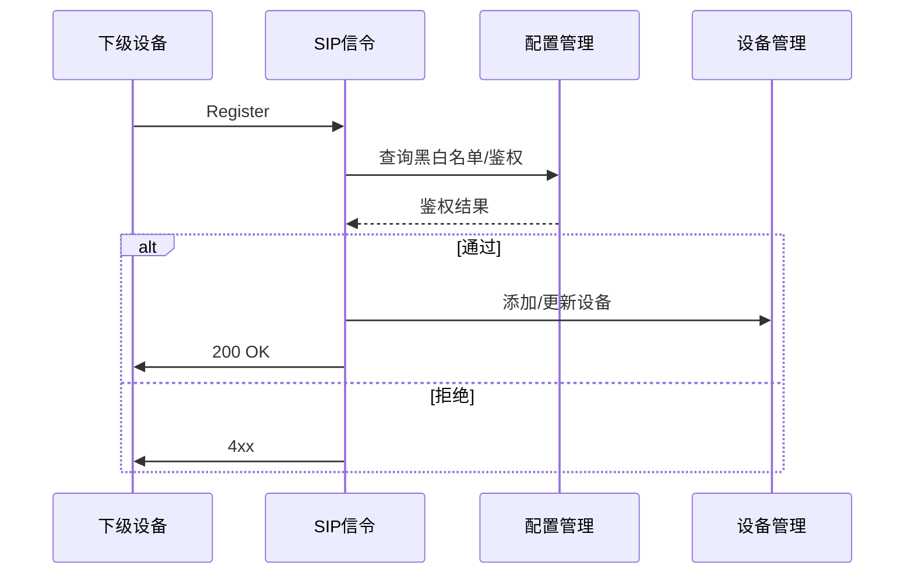

1. 设备发起 SIP Register
2. SIP 信令模块向配置管理查询：黑名单（禁止）、白名单（免鉴权或需鉴权）、独立鉴权密码；若既在白名单又配置了独立密码，实现时约定优先级（如：有独立密码则校验密码，否则免鉴权）
3. 通过则写入设备管理，返回 200 OK；否则返回 4xx

### 5.2 服务端：实时点播

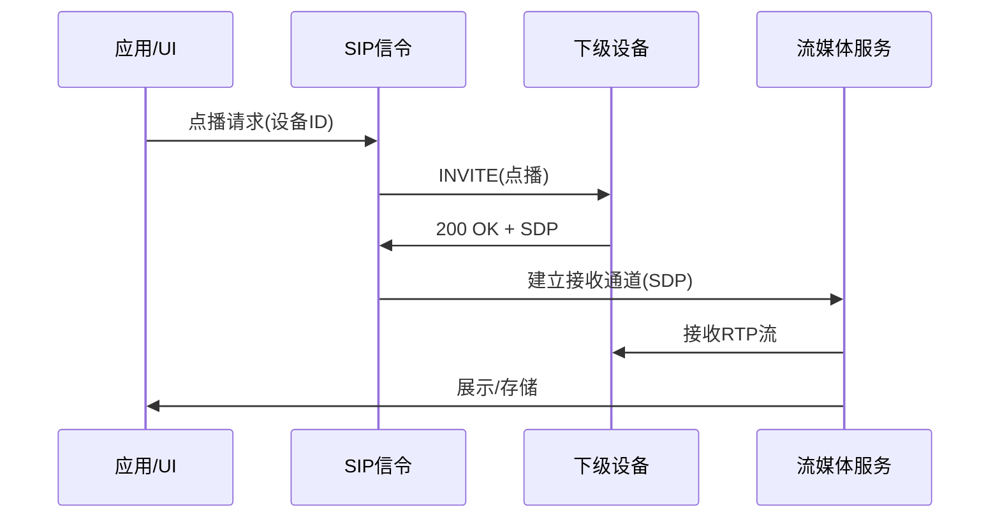

1. 应用发起点播（仅对已注册上线设备可点播）
2. 流媒体服务先调 ZLM openRtpServer(stream_id) 得到收流端口，生成 SDP
3. SIP 向设备发送 INVITE（点播），SDP 中携带本机 IP 与 ZLM 收流端口
4. 设备返回 200 OK 后按 SDP 向 ZLM 推送 RTP；ZLM 收流后可转 RTSP/HTTP-FLV 等供前端播放

### 5.3 服务端：历史回放

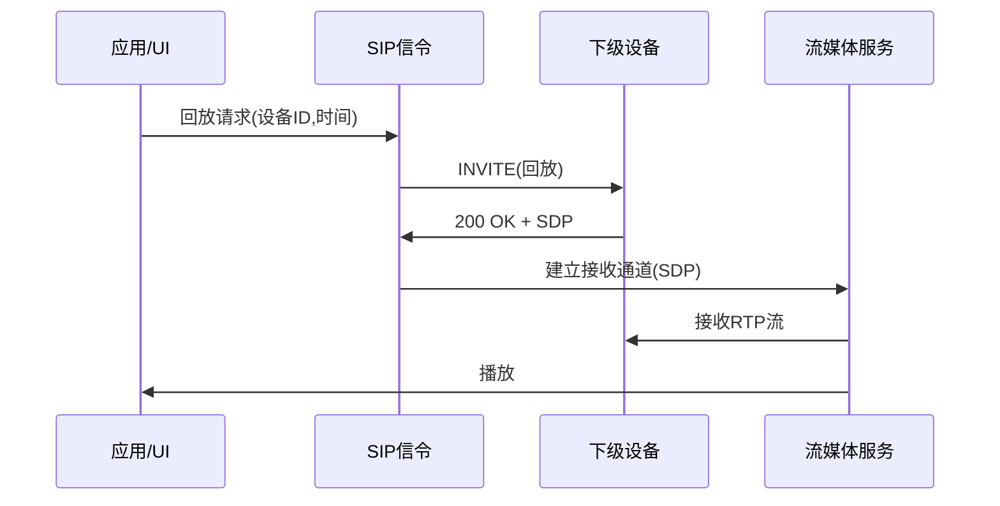

流程与点播类似，INVITE 中携带回放时间范围。

### 5.4 服务端：云台控制

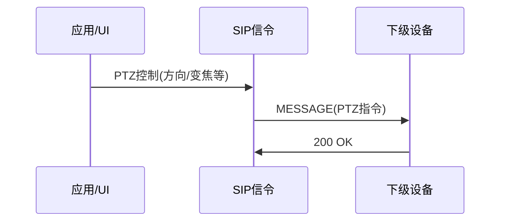

### 5.5 客户端：平台接入

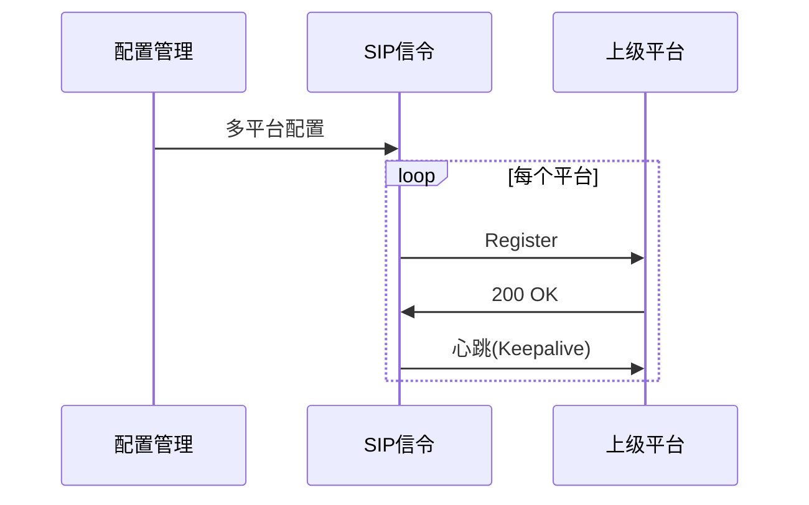

### 5.6 客户端：目录推送

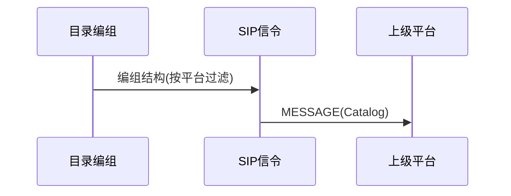

### 5.7 客户端：媒体响应

上级请求的流若尚未在流媒体中，由 SIP 控制下级推流至 ZLM，再转发给上级：

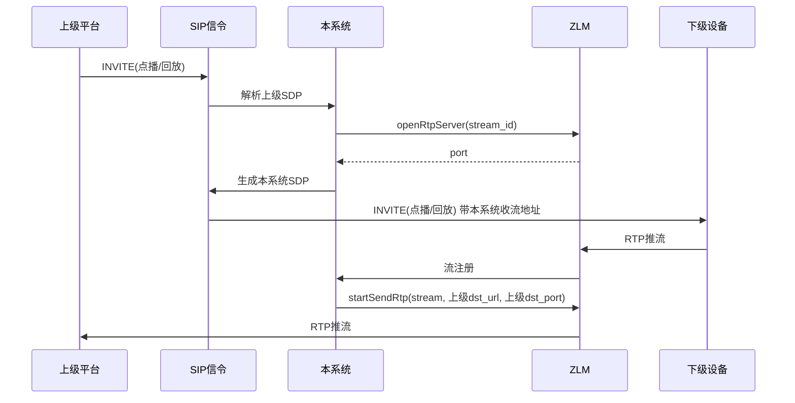

---

## 6. 接口设计要点

### 6.1 SIP 信令格式

遵循 GB28181-2022 的 SIP 消息格式与流程，包括：

- **Register**：设备/平台注册，支持 Digest 鉴权
- **Invite**：点播、回放、对讲等会话建立
- **Message**：Catalog、Notify（告警）、PTZ 控制、设备信息等
- **Keepalive**：心跳保活

### 6.2 模块间接口

| 调用方 | 被调用方 | 接口内容 |
|--------|----------|----------|
| 配置管理 | 各模块 | 读取本地国标信息、流媒体配置、黑白名单、下级独立配置 |
| SIP 信令 | 设备管理 | 注册成功时添加/更新设备；查询设备是否存在 |
| SIP 信令 | 流媒体服务 | 点播/回放建立时传递 SDP，建立 RTP 通道 |
| SIP 信令 | 媒体推送 / 流媒体服务 | 收到上级 INVITE 时：协调 openRtpServer、向下级发 INVITE、下级推流到 ZLM 后调 startSendRtp 转发上级 |
| SIP 信令 | 目录编组 | 生成 Catalog 内容 |
| SIP 信令 | 告警处理 | 收到 Notify 时写入告警；客户端上报时构造 Notify |
| ZLM Web Hook | 流媒体服务 / SIP | 处理 on_stream_changed、**on_stream_none_reader**（无人观看时 closeRtpServer/stopSendRtp + BYE）等 |
| 前端 / HTTP 服务 | 用户与鉴权 | 登录、登出、修改密码、校验 token/session |
| 各业务模块 | 基础设施（ZLToolKit） | 注册 HTTP 路由、WebSocket 通道、定时任务以及日志输出等基础能力 |

### 6.3 扩展点

- **平台级联**：客户端模式复用，作为下级平台接入上级
- **语音对讲/广播**：扩展 INVITE/Message 流程
- **事件订阅**：扩展 Message 的订阅与 Notify
- **图像抓拍、软件升级**：扩展 Message 类型

---

## 7. 部署架构

### 7.1 部署模式

**采用单进程部署 + Nginx 反向代理**：

| 组件 | 说明 |
|------|------|
| **Nginx** | 反向代理：对外提供 HTTP/HTTPS（如 80/443），将请求转发至本系统 8080；可代理前端静态资源、API 及 WebSocket，必要时代理播放流以统一出口与跨域 |
| 本系统（C++） | **单进程**，基于 ZLToolKit 提供 HTTP API/WebSocket、网络 IO、线程池与日志，SIP 信令、业务逻辑、设备管理、服务端与客户端模式同进程运行，通过 HTTP API 与 ZLM、PostgreSQL 交互；监听 8080，由 Nginx 转发 |
| ZLMediaKit | 独立进程 MediaServer，通过 HTTP API（880/8443）与本系统通信，负责 RTP 收发、录像、转协议 |

本系统单进程运行，ZLM 独立部署；对外访问经 Nginx 进入本系统，本系统通过 HTTP 调用 ZLM。

### 7.2 端口规划

| 用途 | 端口 | 说明 |
|------|------|------|
| Nginx | 80/443（可配置） | 对外入口，反向代理到本系统 8080（及可选 ZLM 播放流） |
| 本系统 HTTP 服务 | 8080（可配置） | 提供前端页面（Vue 静态资源）及 REST API、WebSocket，供 Nginx 转发 |
| 本系统 SIP 信令（服务端） | 5060（可配置） | 接收下级注册、信令 |
| 本系统 SIP 信令（客户端） | 动态或配置 | 向上级发起信令 |
| ZLM HTTP API | 880/8443（可配置） | 本系统调用 openRtpServer、startSendRtp 等 |
| ZLM 默认 RTP 收流 | 10000 | 可选；或通过 openRtpServer 动态创建端口 |
| ZLM RTP 端口（openRtpServer） | 动态分配 | 每路流一个端口，超时自动回收 |
| ZLM 播放端口 | 以 ZLM 配置为准 | RTSP 554、RTMP 1935、HTTP-FLV/HLS 等，供前端 jessibuca 播放 |

### 7.3 网络拓扑示意

```
  浏览器 ──────► Nginx (80/443) ──► 本系统 8080 (Vue + API + WebSocket)
                    │
下级设备/平台 ──────►│  ┌─────────────────────────┐
                    │  │   国标服务器系统          │
                    │  │  ┌─────┐  ┌─────┐       │
                    └─►│  │SIP  │  │Media│       │
                       │  │5060 │  │ZLM  │       │
                       │  └─────┘  └─────┘       │
                       │  ┌─────┐  ┌─────┐       │
                       │  │SIP  │  │Media│       │
                       │  │Client│ │Push │       │
                       │  └──┬──┘  └──┬──┘       │
                       └─────│───────│──────────┘
                             │       │
                             ▼       ▼
                       上级平台
```

---

## 8. 技术选型

### 8.1 已确定选型

| 类别 | 选型 | 说明 |
|------|------|------|
| 开发语言 | **C++** | 后端主语言，便于与 PJSIP（C）和 ZLMediaKit（C++）集成 |
| 网络与基础库 | **ZLToolKit** | 基于 C++11 的轻量级网络框架，提供 TCP/UDP、线程池、定时器、日志、配置等能力，ZLMediaKit 亦基于该库 |
| 反向代理 | **Nginx** | 对外 HTTP/HTTPS 入口，转发至本系统 8080，可选代理播放流 |
| SIP 信令 | **PJSIP** | 成熟 SIP 库，支持注册、Invite、Message、SDP 等，C 实现，跨平台 |
| 媒体处理 | **ZLMediaKit** | 流媒体服务器，支持 RTP 收发、录像、转码、GB28181 接入与输出 |
| 配置存储 | **PostgreSQL** | 关系型数据库，存储配置、设备树、告警记录等 |
| 前端页面 | **Vue + Element Plus** | 前端框架 Vue 3 搭配 Element Plus UI 组件库，用于管理界面、设备树、视频预览、告警展示等 |
| 视频播放器 | **jessibuca** | 基于 wasm，支持 H.264/H.265，用于实时预览与回放 |

### 8.2 架构中的角色

- **C++**：后端主语言，业务逻辑、SIP 信令处理、用户鉴权、与 ZLMediaKit/PostgreSQL 集成
- **ZLToolKit**：提供网络 IO、TCP/UDP 服务器、HTTP API 与 WebSocket 服务、线程池、定时器、日志、配置等基础设施，上层的 SIP 信令、流媒体协调和管理 API 均基于该库构建
- **Nginx**：对外统一入口，反向代理至本系统；部署时前端与 API 经 Nginx 访问
- **PJSIP**：负责 SIP 信令通道（注册、心跳、目录、点播/回放信令、控制信令）
- **ZLMediaKit**：负责媒体通道（RTP 接收/推送、录像存储、流分发、H.264/H.265 处理）
- **PostgreSQL**：存储系统配置、黑白名单、设备信息、告警记录等
- **Vue + Element Plus**：负责 Web 管理界面，使用 Vue 3 作为前端框架、Element Plus 作为 UI 组件库，通过 HTTP/WebSocket 与后端交互，统一表单、表格和布局风格
- **jessibuca**：前端视频播放器，支持 H.264/H.265，用于实时预览与回放

---

## 9. PJSIP 与 ZLMediaKit 集成说明

### 9.1 PJSIP 使用要点

**API 选择**：使用 **PJSUA2**（C++ 封装），便于与 C++ 后端集成。

**核心流程**（参考 [PJSIP Hello World](https://docs.pjsip.org/en/latest/pjsua2/hello_world.html)）：

```
Endpoint.libCreate() → libInit() → transportCreate() → libStart()
Account.create(AccountConfig) → onRegState 回调
```

**关键类**：`Endpoint`、`Account`、`AccountConfig`、`TransportConfig`、`AuthCredInfo`。

**GB28181 扩展**：PJSIP 提供通用 SIP 能力，GB28181 特有的 Message 格式（Catalog、Notify、PTZ 等）需在业务层按国标规范构造与解析。可参考 [BXC_SipServer](https://github.com/any12345com/BXC_SipServer)（C++ 国标信令服务器）等开源实现。

**文档**：https://docs.pjsip.org/

### 9.2 ZLMediaKit 使用要点

**集成方式**：**独立进程 + HTTP API**

本系统采用 ZLMediaKit 独立部署 MediaServer，通过 RESTful API 与本系统 C++ 后端通信。本系统负责 SIP 信令与业务逻辑，ZLM 负责媒体收发、录像、转协议等。

**GB28181 收流**（服务端）：

- 默认端口 10000：接收 UDP/TCP RTP 推流，`stream_id` 由 RTP SSRC 自动生成
- **openRtpServer**：按设备/通道创建专用端口，可指定 `stream_id`，便于与设备 ID 对应
  - 参数：`port`（0=随机）、`tcp_mode`（0=UDP/1=TCP被动/2=TCP主动）、`stream_id`
  - 超时无流自动回收，无需显式关闭
- **closeRtpServer**：按 `stream_id` 关闭端口
- **listRtpServer**：查询已创建的 RTP 端口

**GB28181 推流**（客户端）：

- **startSendRtp**：将已注册流（RTSP/RTMP/HLS 等）转为 PS-RTP 推送到目标
  - 参数：`vhost`、`app`、`stream`、`ssrc`、`dst_url`、`dst_port`、`is_udp`
- **startSendRtpPassive**：TCP 被动模式，ZLM 建 TCP 服务等待平台连接后推流
- **stopSendRtp**：停止推流

**编码支持**：H.264/H.265/AAC/G711/OPUS 等。

**无人观看断流**（节省实时流带宽）：
- 利用 ZLM 的 **on_stream_none_reader** Web Hook：当某路流观看人数为 0 时，ZLM 回调本系统
- 本系统在 Hook 中可返回「关闭该流」：服务端模式下调用 **closeRtpServer** 并向下级设备发 SIP BYE，停止设备推流；客户端模式下调用 **stopSendRtp** 停止向上级转发
- ZLM 配置项 `general.streamNoneReaderDelayMS` 可设置无人观看判定延迟，避免频繁启停
- 效果：无人预览、无人级联拉流时自动断流，节省设备→ZLM、ZLM→上级的带宽

**文档**：[ZLMediaKit Wiki](https://github.com/ZLMediaKit/ZLMediaKit/wiki)、[GB28181 推流](https://github.com/xia-chu/ZLMediaKit/wiki/GB28181%E6%8E%A8%E6%B5%81)、[HTTP API](https://github.com/zlmediakit/ZLMediaKit/wiki/MediaServer%E6%94%AF%E6%8C%81%E7%9A%84HTTP-API)

### 9.3 服务端集成流程

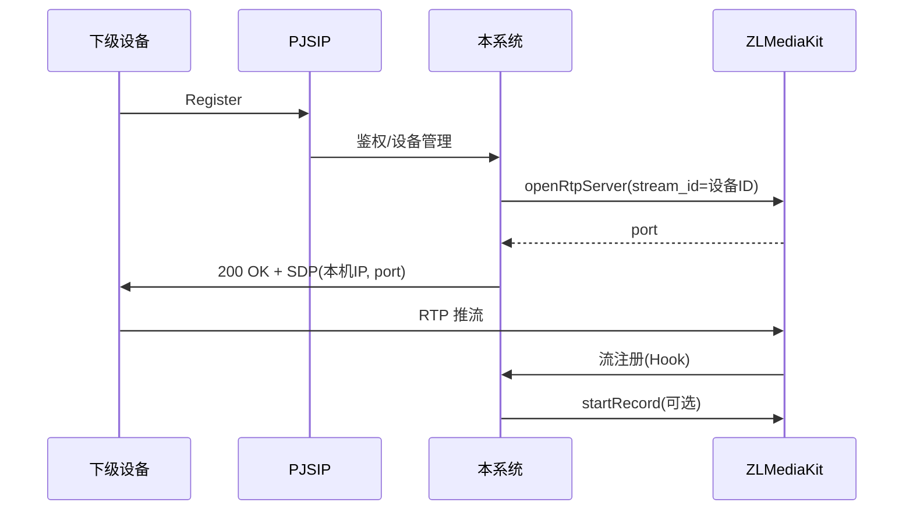

1. 设备 Register 时，本系统调用 ZLM `openRtpServer` 创建收流端口，`stream_id` 与设备/通道 ID 绑定
2. 在 SIP 200 OK 的 SDP 中填入本机 IP 与 ZLM 返回的端口
3. 设备按 SDP 向该端口推送 RTP
4. 本系统向 ZLM 配置 Web Hook 回调地址（如 `http://本系统:8080/api/zlm/hook`），通过 `on_stream_changed` 感知流注册（可触发录像），通过 **on_stream_none_reader** 感知无人观看并断流以节省带宽（见 9.5）

### 9.4 客户端集成流程

上级请求的流此时未必已在 ZLM 中，**由 SIP 指令控制下级推流到 ZLM，再转发给上级**：

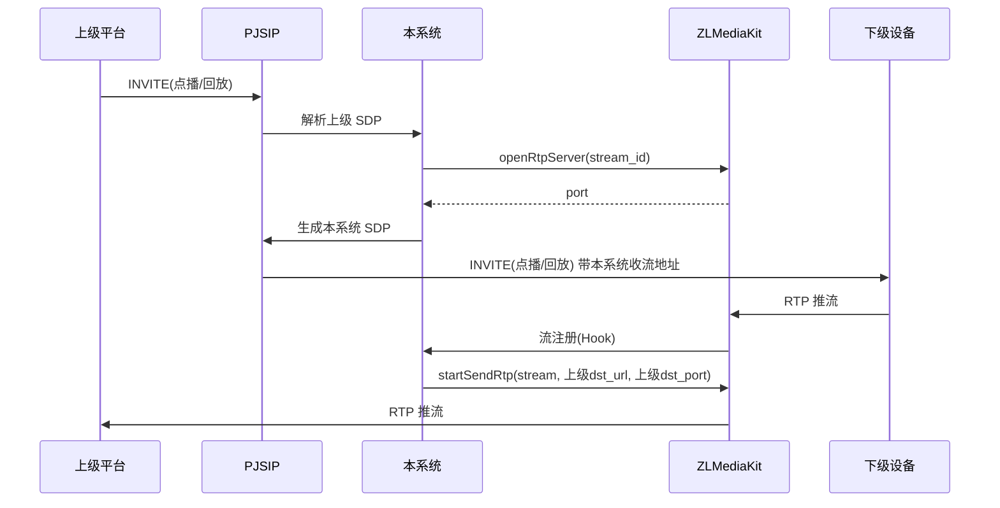

1. 本系统作为客户端向平台 Register
2. 收到平台 INVITE 后解析上级 SDP，得到上级媒体接收地址
3. 本系统调用 ZLM `openRtpServer` 得到本系统收流端口，向**下级设备**发 INVITE（点播/回放），SDP 中带本机收流地址
4. 下级向 ZLM 推送 RTP，ZLM 流注册后本系统调用 `startSendRtp` 将 ZLM 该路流转发到上级

### 9.5 无人观看断流（节省带宽）

**策略**：利用 ZLMediaKit 无人观看断流特性，减少无观众时的实时流占用。

| 场景 | 触发 | 本系统动作 |
|------|------|------------|
| 服务端-实时点播 | ZLM 回调 `on_stream_none_reader`（该路流无人播放、无录像等） | 调用 ZLM `closeRtpServer(stream_id)`，并向该路设备发 SIP BYE，停止设备推流 |
| 客户端-向上级转发 | ZLM 回调 `on_stream_none_reader`（向上级 startSendRtp 的流无人观看） | 调用 ZLM `stopSendRtp`，停止向上级推送；可选：向下级发 BYE 停止下级推流 |

- 本系统在 Web Hook 处理中解析 `on_stream_none_reader`，根据 stream_id 映射到设备/会话，执行上述断流与 BYE
- ZLM 配置 `general.streamNoneReaderDelayMS` 设置无人观看判定延迟（如 10–30 秒），避免短暂关闭页面即断流

### 9.6 播放与录像

- **播放**：ZLM 收到 RTP 后自动生成 RTSP/RTMP/HLS/HTTP-FLV 等 URL，前端可通过 `rtsp://ip:554/rtp/stream_id` 等形式播放
- **录像**：调用 ZLM `startRecord` 接口，支持 FLV/HLS/MP4
- **回放**：ZLM 支持 MP4 点播，或向设备发起回放 INVITE 后由设备推流到 ZLM
- **前端播放**：建议使用 ZLM 的 HTTP-FLV 或 HLS URL（jessibuca 支持），由本系统后端提供「获取某通道播放 URL」的 API，避免前端直连 ZLM 带来的跨域与暴露

### 9.7 待实现阶段明确的内容

- **REST API**：前后端接口清单与报文格式在详细设计时细化
- **日志**：关键操作（注册、点播、控制、告警、ZLM 调用）写日志，存储方式与级别实现时确定
- **用户与鉴权**：已明确——用户登录，默认 **admin** / **admin**，支持修改密码；会话/token 校验保护 API 与 WebSocket
- **错误与重试**：ZLM 调用失败、SIP 超时时的返回与重试策略实现时约定
- **客户端媒体源**：已明确——上级请求的流由 SIP 控制下级向本系统（ZLM）推流，再由 ZLM 转发给上级，不依赖 ZLM 上预先存在的流

---

## 附录：功能清单映射

| 功能模块 | 功能 ID |
|----------|---------|
| 用户与鉴权 | AUTH-001, AUTH-002, AUTH-003 |
| 配置管理 | CFG-001, CFG-002 |
| 设备接入 | SVR-101~110 |
| 实时视频 | SVR-201~203 |
| 录像回放 | SVR-301~304 |
| 设备控制 | SVR-401~405 |
| 告警事件 | SVR-501~503 |
| 语音 | SVR-601~602 |
| 平台级联 | SVR-701~703 |
| 运维扩展 | SVR-801~803 |
| 目录编组 | CLT-001~003 |
| 平台接入 | CLT-101~104 |
| 信息上报 | CLT-201~204 |
| 媒体流 | CLT-301~303 |
| 远程控制 | CLT-401~403 |
| 告警事件 | CLT-501~502 |
| 语音 | CLT-601~602 |
| 扩展能力 | CLT-701~703 |
